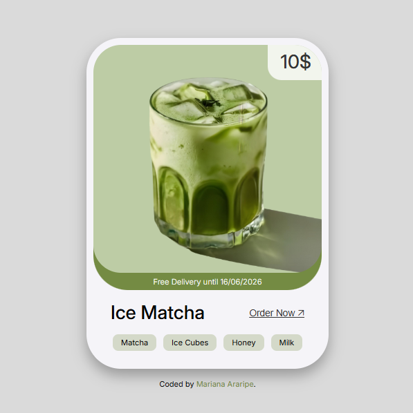

# Matcha Product Card

Projeto simples de um card de produto inspirado em um design do Pinterest, recriado com React, Vite, TypeScript e CSS puro.

---

## 🚀 Tecnologias Utilizadas

- React
- Vite
- TypeScript
- CSS3 com variáveis personalizadas  
- Flexbox  
- Google Fonts (Inter)

---

## 🎯 Objetivo

Criar um card visual para o produto Ice Matcha, com:

- Estruturação com Flexbox
- Responsividade baseada em breakpoints
- Estilização clean e funcional
- Base para futura responsividade e interatividade

---

## 📸 Screenshots

---

## 🔗 Links

- [🔗 Visualizar Projeto](https://matcha-product-card.vercel.app/)
- [📂 Código no GitHub](https://github.com/marianaararipe/matcha-product-card)

---

## 💡 Próximos passos planejados

- Tornar o card responsivo para dispositivos móveis
- Implementar menu para selecionar diferentes produtos e atualizar o card dinamicamente

---

## 👤 Autor

- **GitHub:** [@marianaararipe](https://github.com/marianaararipe)  
